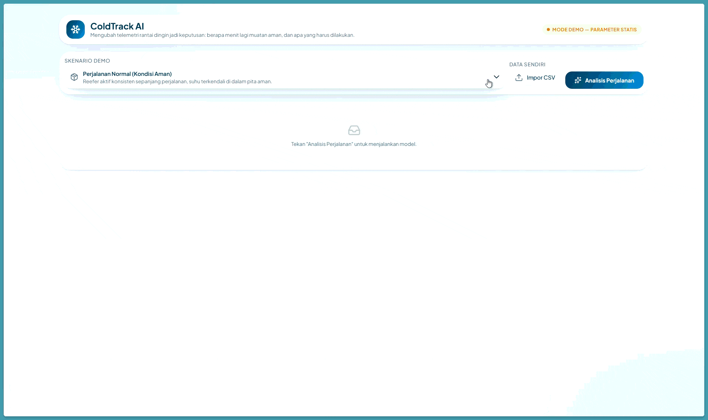

# ColdTrack AI

Sistem prediksi dini kegagalan rantai dingin (cold chain) berbasis AI, dibangun untuk COMPFEST 18 AI Innovation Challenge — kategori Smart Logistics.



*Alur demo: pilih salah satu dari lima skenario telemetri, klik "Analisis Perjalanan", lalu sistem
menampilkan status, Time-to-Breach, diagnosis mode kegagalan, faktor pendorong, dan tiga langkah
tindakan.*

## Cara Menjalankan

### Production Mode (Standalone Build)
```bash
docker compose up --build
```

### Development Mode (Live Reload / Hot Refresh)
```bash
docker compose -f docker-compose.dev.yml up --build
```

## Struktur Repo

```
coldtrack-ai/
  backend/     FastAPI (sinkron, tanpa database, tanpa background job)
  frontend/    Next.js 14
  ml/          Simulator data, notebook, dan ekspor model GRU ke ONNX
  docs/        Dataset card, model card, AI governance, feature schema, architecture
```

## Dokumentasi

- [Architecture](docs/architecture.md)
- [Feature Schema](docs/feature_schema.md)
- [Dataset Card](docs/dataset_card.md)
- [Model Card](docs/model_card.md)
- [AI Governance](docs/ai_governance.md)
